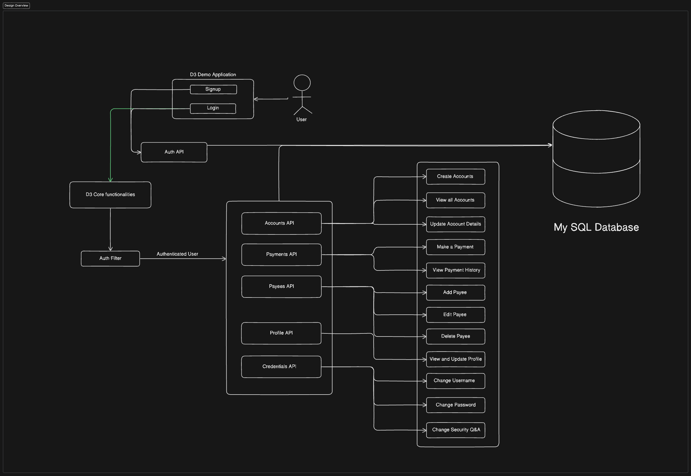

**Design Overview**  

**User Authentication & Access Control**

* The system starts with **user authentication**, allowing users to sign up and log in.

* Authentication and authorization are managed by the **User APIs**, ensuring secure access to banking features.

**Core Banking Modules**

* **Accounts Module**: Manages account creation and updates.

* **Payments Module**: Handles transaction processing and payment history retrieval.

* **Payees Module**: Enables users to add, update, or delete beneficiaries for transactions.

* **Credentials Module**:Allows users to change their username,password and Security Question(Security).

* **Profile Module**: Enables users to add or update profile details.

**Modules Description:**

**Accounts Module**

* Create Accounts: A user can open new bank accounts.

* Update Account Details: Change account information (e.g., Account Name).

**Payments Module**

* Make Payments: Initiate transactions or money transfers.

* Payment History: Retrieve past transactions.

**Payees Module**

* Add Payee: Add a new beneficiary for payments.

* Update Payee: Edit an existing payee’s details.

* Delete Payee: Remove a payee.

**Credentials Module**

* Change Username: Allows users to update their existing username to a new one after verifying the current password.

* Change Password: Enables users to update their password after verifying the current password.

* Update Security Question: Lets users modify their security question and answer.

#### **Profile Module**

* Add Profile Details: Users can add personal information such as Middle Name, contact number, and address.

* Update Profile Information: Allows users to modify existing details to keep their profile up to date.

**API**

**Authentication APIs:**

* **`POST /auth/signup`**  
   ***Registers a new user account.***  
    
* **`POST /auth/login`**  
   ***Authenticates a user and returns a JWT token.***  
    
* **`POST /auth/unlock`**  
   ***Allows admin/bank to unlock a user.***

**Account APIs:**

* **`GET /accounts/all`**  
   ***Retrieves all accounts of the user.***  
    
* **`POST /accounts/create`**  
   ***Creates a new account for the user.***  
    
* **`PUT /accounts/update`**  
   ***Updates the account details of the user's account.***

**Payments APIs:**

* **`POST /api/payments/make`**  
   ***Initiates a fund transfer between accounts.***

* **`GET /api/payments/history/{userid}`**  
   ***Fetches payment history of a user.***

**Payees APIs:**

* **`GET /api/payees`**  
   ***Lists all payees associated with the authenticated user.***

* **`POST /api/payees`**  
   ***Adds a new payee to the user's list.***

* **`PUT /api/payees/{id}`**  
   ***Updates existing payee details.***

* **`DELETE /api/payees/{id}`**  
   ***Removes a payee from the user’s account.***

**Credentials APIs:**

* **`PUT /credentials/updateUsername`**  
   ***Allows users to change their username.***  
    
* **`PUT /credentials/updatePassword`**  
   ***Allows users to change their password.***  
    
* **`PUT /credentials/updateSecurityQA`**  
   ***Allows users to change their Security Question.***

**Profile APIs:**

* **`PUT /profile/update`**  
   ***Allows the user to update their profile.***  
    
* **`GET /profile/show`**  
   ***Displays user profile.***

**Database:**  

1. **Users Table (`users`)**

   * **Stores user authentication and profile details such as `username`, `password`, and `security_question`.**

   * **Includes security attributes like `locked` and `login_attempts` to enhance authentication.**

   * **Has a one-to-many relationship with `accounts` (one user can have multiple accounts).**

2. **Accounts Table (`accounts`)**

   * **Represents bank accounts associated with users, storing details such as `account_number`, `account_type` (Checking/Savings), and `balance`.**

   * **Foreign key (`userid`) links accounts to users.**

   * **Has a one-to-many relationship with `payments` (one account can be involved in multiple transactions).**

3. **Payments Table (`payments`)**

   * **Captures details of transactions such as `amount`, `payment_date`, `payee_type`, and `status`.**

   * **Contains foreign keys `from_account_id` and `to_account_id` linking transactions to accounts.**

   * **Has a many-to-one relationship with `accounts` (multiple payments can be made from the same account).**

4. **Payees Table (`payees`)**

   * **Stores payee details for transactions, including `name`, `account_number`, `phone_number`, and `address`.**

   * **Tracks `created_at` timestamps for payee additions.**

   * **Foreign key `account_number` links a payee to an account.**

   * **Has a one-to-many relationship with `payments` (a payee can receive multiple payments).**

#### **Entity Relationships Summary**

* **`users (1) → (M) accounts`**

* **`accounts (1) → (M) payments`**

* **`accounts (1) → (M) payees`**

* **`payees (1) → (M) payments`**

